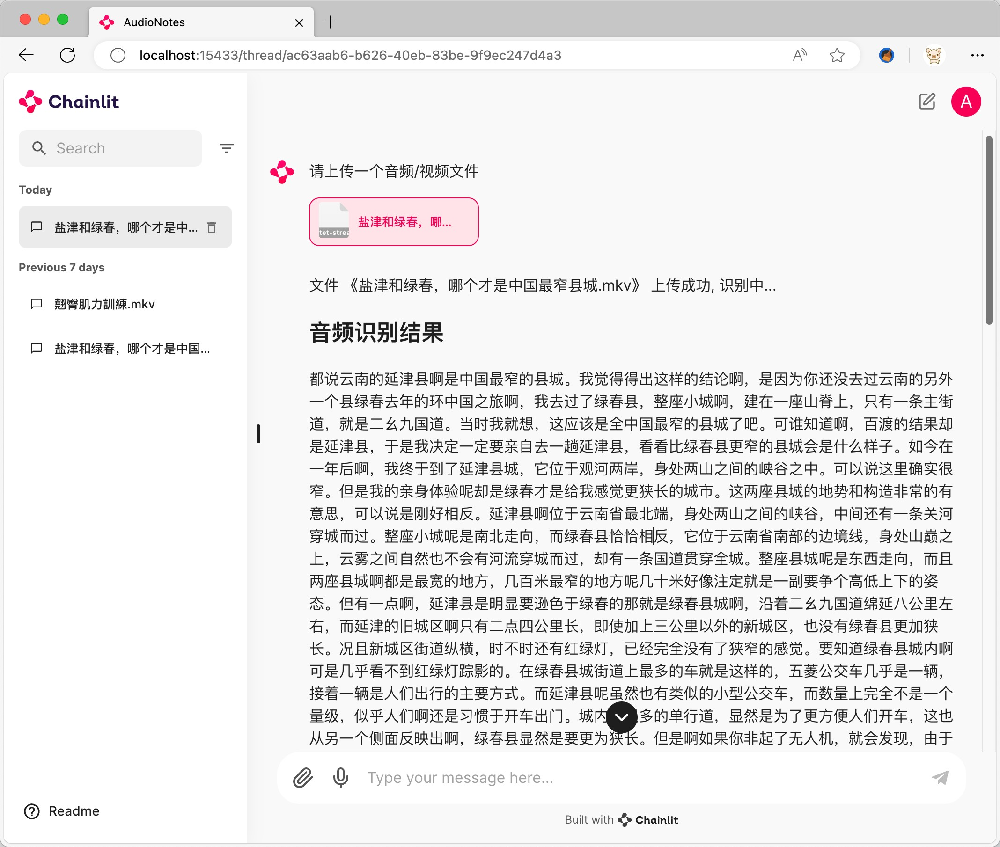
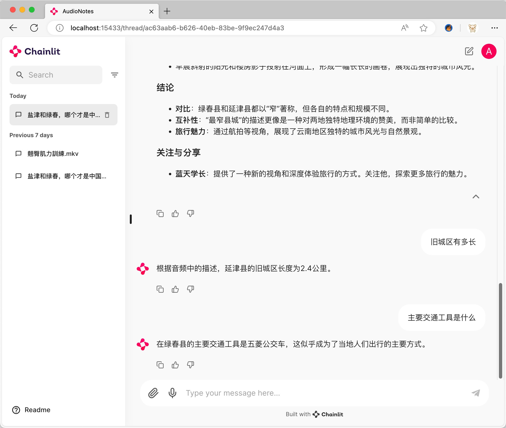

# AudioNotes

## 基于 FunASR 和 Qwen2 构建的音视频转结构化笔记系统

能够快速提取音视频的内容，并且调用大模型进行整理，成为一份结构化的markdown笔记，方便快速阅读

FunASR: https://github.com/modelscope/FunASR

Qwen2: https://ollama.com/library/qwen2

## 效果展示

### 音视频识别和整理



### 与音视频内容对话



## 使用方法

### ① 安装 Ollama

下载对应系统的 Ollama 安装包进行安装

https://ollama.com/download

### ② 拉取模型

我以 `阿里的千问2 7b` 为例 https://ollama.com/library/qwen2

```bash
ollama pull qwen2:7b
```

### ③ 部署服务

有两种部署方式，一种是使用 Docker 部署，另一种是本地部署

#### Docker 部署（推荐）

```bash
### Docker 部署
```bash
curl https://github.com/harry0703/AudioNotes/raw/main/docker-compose.yml -o docker-compose.yml
docker-compose up
```

#### 本地部署

需要有可访问的 postgresql 数据库

```bash
conda create -n AudioNotes python=3.10 -y
conda activate AudioNotes
git clone https://github.com/harry0703/AudioNotes.git
cd AudioNotes
pip install -r requirements.txt
```

将 `.env.example` 重命名为 `.env`，修改相关配置信息

```bash
chainlit run main.py
```
